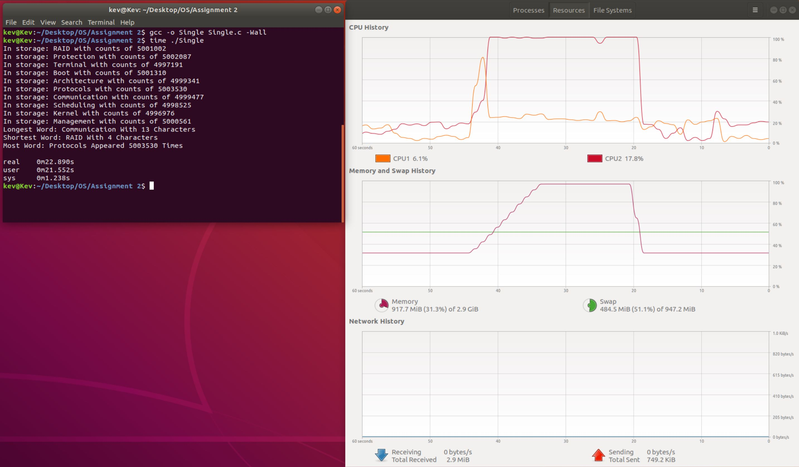

## Multithreading
Project for CSC 332 - Operating Systems with Professor Zaid Al-Mashhadni at the City College of New York.
## About The Project
- There is a file.txt. that contains 50,000,000 random words (e.g. Communication,
Protocols, and Architecture), and we wrote a serial program (single thread) to read it. After that, the program will copy the words to some form of a list to find:
  1. The longest word
  2. The shortest word
  3. The most common word
- Then, improve your program utilizing multiple threads equal to the number of the cores you have on your machine. After reading the words to the same list by a single thread, divide the list evenly between the pool of threads, so that each thread will do the same search concurrently.
## Additional Information
-  I used one thread to read the file.txt and made it store into an array of size 50,000,000. I then implemented my own map function which used that array and stored the count of each word into a separate array. I used multithreading in the map function to make the process a lot faster. Since everything was already organized and confined in a small array (instead of 50,000,000), I just called the three functions (longestword,shortestword,mostcommonword) to get the results from the small array. 
- There are comments in the code that illustrates the thought process and exactly what each line of code is doing.
## Using the Application
### Single Thread

### Multithreading

## Ask me about anything
If there are any questions, feel free to ask them [here](https://github.com/ChibiKev/Multithreading/issues).